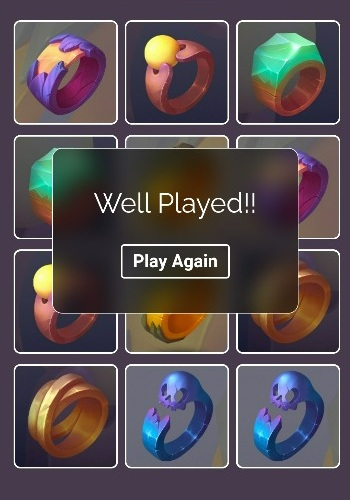

# MemoryVerse | Cards Matching Game

Memoryverse is a cards matching game, where the player tries to match all the cards with same image in minimum number of flips.

## Table of contents

- [MemoryVerse | Cards Matching Game](#memoryverse--cards-matching-game)
  - [Table of contents](#table-of-contents)
  - [Overview](#overview)
    - [Links](#links)
    - [Built with](#built-with)
    - [Screenshot](#screenshot)
      - [Various Themes/Levels](#various-themeslevels)
  - [Author/Developer](#authordeveloper)

## Overview

### Links

- Code URL : [https://github.com/AmishRanpariya/Memoryverse](https://github.com/AmishRanpariya/Memoryverse)
- Live Site URL : [https://memoryverse.netlify.app/](https://memoryverse.netlify.app/)

### Built with

- Semantic HTML5 markup
- CSS Grid
- CSS Flex
- React - JS library
- LocalStorage

### Screenshot

#### Various Themes/Levels

## Author/Developer

- Website - [Amish Ranpariya](https://amishranpariya.github.io/linkinbio/)
- Github - [@amishranpariya](https://github.com/AmishRanpariya)
- LinkedIn - [@amishranpariya](https://www.linkedin.com/in/amish-ranpariya-753662156/)
